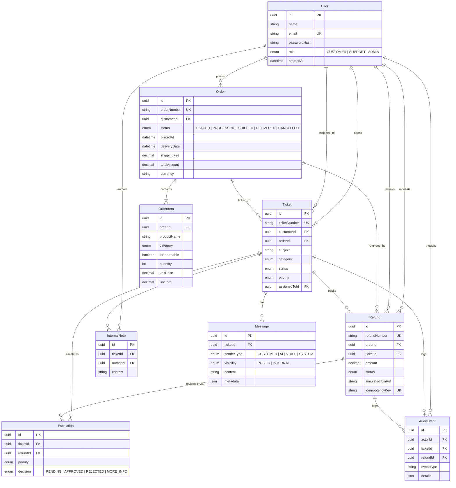

# Kestrel Care — Entity Relationship Diagram

```mermaid
erDiagram
  User ||--o{ Order : places
  User ||--o{ Ticket : opens
  User ||--o{ Ticket : assigned_to
  User ||--o{ Refund : requests
  User ||--o{ Refund : reviews
  User ||--o{ InternalNote : authors
  User ||--o{ AuditEvent : triggers

  Order ||--|{ OrderItem : contains
  Order ||--o{ Ticket : linked_to
  Order ||--o{ Refund : refunded_by

  Ticket ||--o{ Message : has
  Ticket ||--o{ Refund : tracks
  Ticket ||--o{ Escalation : escalates
  Ticket ||--o{ InternalNote : has_private
  Ticket ||--o{ AuditEvent : logs

  Refund ||--o{ Escalation : reviewed_via
  Refund ||--o{ AuditEvent : logs

  User {
    uuid id PK
    string name
    string email UK
    string passwordHash
    enum role "CUSTOMER | SUPPORT | ADMIN"
    datetime createdAt
  }
  Order {
    uuid id PK
    string orderNumber UK
    uuid customerId FK
    enum status "PLACED | PROCESSING | SHIPPED | DELIVERED | CANCELLED"
    datetime placedAt
    datetime deliveryDate
    decimal shippingFee
    decimal totalAmount
    string currency
  }
  OrderItem {
    uuid id PK
    uuid orderId FK
    string productName
    enum category
    boolean isReturnable
    int quantity
    decimal unitPrice
    decimal lineTotal
  }
  Ticket {
    uuid id PK
    string ticketNumber UK
    uuid customerId FK
    uuid orderId FK
    string subject
    enum category
    enum status
    enum priority
    uuid assignedToId FK
  }
  Message {
    uuid id PK
    uuid ticketId FK
    enum senderType "CUSTOMER | AI | STAFF | SYSTEM"
    enum visibility "PUBLIC | INTERNAL"
    string content
    json metadata
  }
  Refund {
    uuid id PK
    string refundNumber UK
    uuid orderId FK
    uuid ticketId FK
    decimal amount
    enum status
    string simulatedTxnRef
    string idempotencyKey UK
  }
  Escalation {
    uuid id PK
    uuid ticketId FK
    uuid refundId FK
    enum priority
    enum decision "PENDING | APPROVED | REJECTED | MORE_INFO"
  }
  InternalNote {
    uuid id PK
    uuid ticketId FK
    uuid authorId FK
    string content
  }
  AuditEvent {
    uuid id PK
    uuid actorId FK
    uuid ticketId FK
    uuid refundId FK
    string eventType
    json details
  }
```
